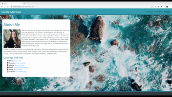

# Nicole Marshall's Portfolio

## Table of Contents

1. [Usage](#Usage)
1. [Languages and Concepts](#Languages-and-Concepts)
1. [Method](#Method)
1. [Demo](#Demo)
1. [Roadmap](#Roadmap)
1. [Links](#Links)
1. [Contact](#Contact)
1. [Contributing](#Contributing)
1. [License](#License)

## Usage

## Languages and Concepts

- HTML5
- CSS
- [Bootstrap](https://getbootstrap.com/) CSS Framework

## Method

## Demo

## Roadmap

## Links

- [Live Portfolio Web Page](https://ncmarsh.github.io/portfolio/)
- [Project Repository](https://github.com/ncmarsh/portfolio) 

## Contact

- Nicole Marshall - [@ncmarsh](https://github.com/ncmarsh)

## Contributing

This is a personal project; no contributions are required at this time.

## License

No license granted.

##### [Return to Top of Page](#Nicole-Marshall's-Portfolio)