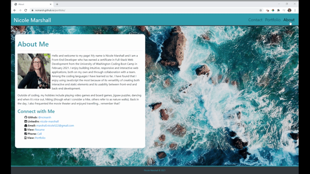

# My Portfolio

Welcome to my Portfolio, where you can find the most up to date information about my experience as a Full-Stack Web Developer.

## Table of Contents

1. [About the Project](#About-the-Project)
1. [Languages and Concepts](#Languages-and-Concepts)
1. [Usage](#Usage)
1. [Demo](#Demo)
1. [Roadmap](#Roadmap)
1. [Links](#Links)
1. [Contact](#Contact)
1. [Contributing](#Contributing)
1. [License](#License)

## About the Project

This Portfolio site features my most recent projects including live and GitHub repository links, along with my contact information and ways to connect.

## Languages and Concepts

- [React.js](https://reactjs.org/)
- [React Router](https://reactrouter.com/)
- [Bootstrap](https://getbootstrap.com/)
- [FontAwesome](https://fontawesome.com/how-to-use/on-the-web/using-with/react)

## Usage

Users (and hopefully recruiters!) can quickly and easily view my most recent projects accompanied by links to find out more, by being able to view my GitHub and LinkedIn profiles and my resume, along with ways to contact me and find out more about my time as a Web Developer.

## Demo

## Roadmap

Now that I am have more projects under my belt, I want to explore adding more interactive objects to my portfolio, like hover effects and image slideshows. I want to look into incorporating a different CSS library and using the GitHub API to access my repositories. I want to add functionality to the contact form and I would like to explore the idea of a feedback page, where users can offer feedback on what they see, offer advice, or propose new project ideas (either for me to work on or to work on together!).

## Links

- [Live Portfolio Web Page](https://ncmarsh.github.io/portfolio)
- [Project Repository](https://github.com/ncmarsh/portfolio) 

## Contact

- Nicole Marshall - [@ncmarsh](https://github.com/ncmarsh)

## Contributing

This is a personal project; no contributions are required at this time.

## License

No license granted.

##### [Return to Top of Page](#My-Portfolio)