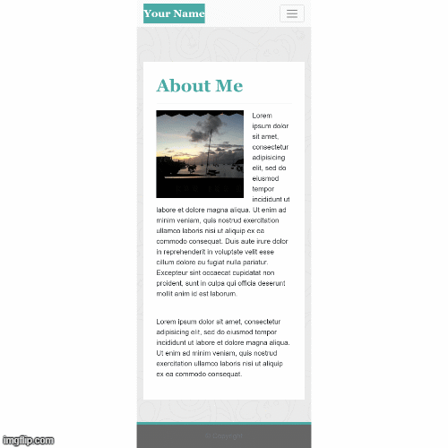
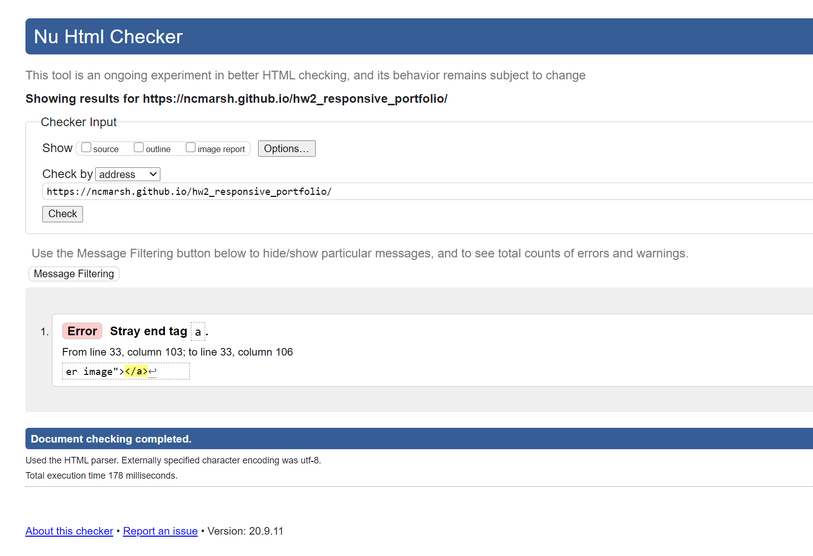
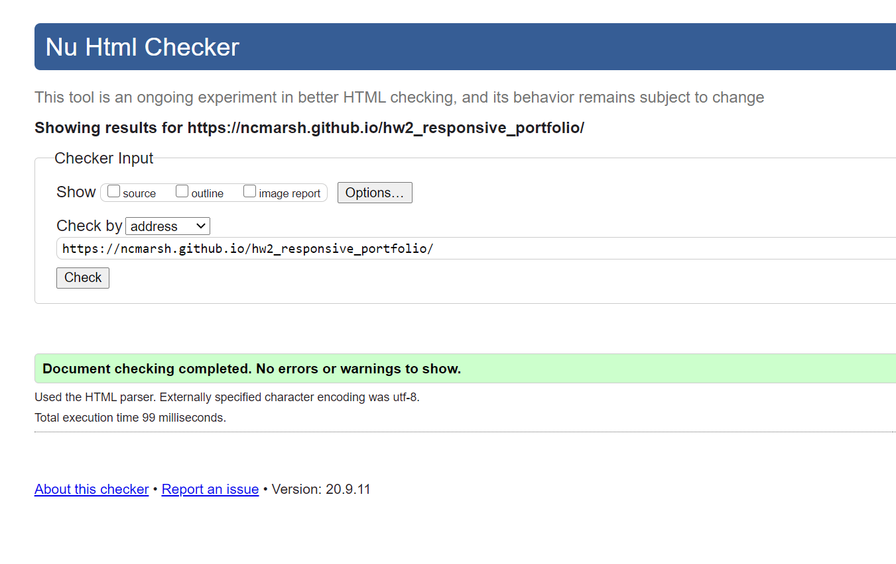

# Responsive Portfolio

Utilizing Bootstrap as the CSS framework, I created a responsive portfolio web page based on specific screenshots of the pages at varying display widths: 400px, 768px, and 992px.

## Table of Contents

1. [Usage](#Usage)
1. [Languages and Concepts](#Languages-and-Concepts)
1. [Method](#Method)
1. [Demo](#Demo)
1. [Validation](#Validation)
1. [Roadmap](#Roadmap)
1. [Links](#Links)
1. [Contributing](#Contributing)
1. [License](#License)

## Usage

By creating a responsive layout, your web page will automatically adjust to whatever screen size the viewer is using to visit your page. This will ensure that all of your information populates correctly and in the layout you want, which gives you a better handle on your web page, its content and the overall look on the different display sizes, from large monitors to tablets to the small screens on our smartphones.

## Languages and Concepts

- HTML5
- CSS
- [Bootstrap](https://getbootstrap.com/) CSS Framework

## Method

To recreate the screenshots given to me, I began by setting up the layout first and then started incorporating styling once the groundwork was laid. My goal while I worked on this project was to also make sure my commits contained related changes to make it easy to navigate through the different versions, if needed.
1. To begin my project, I first set up my three HTML files to create my initial commit.
1. I then created my CSS file and added the code to link the Bootstrap CSS stylesheet and JavaScript frameworks to the three HTML files. I added the \<nav class="navbar"> script to my three HTML pages. 
1. Upon further research, I found a better fit to match the requested style for my \<nav class="navbar">. I then added my name, edited the link names and adjusted them to reflect active when applicable. I also edited the title names of the pages in the \<head>.
1. Next, I adjusted the code spacing of the \<nav class="navbar"> to make it easier to read and added active links to connect the three HTML pages so you can easily navigate between them. 
1. Now that my files should be connected, I used the eyedropper Chrome extension to identify and added the background color to my name to make sure they were connecting to the CSS file. I adjusted the \<nav class="navbar"> links to the right side. Next I began adding in the content. I started with adding the Contact \<form> to the contact page and adding \<h1>'s to the other two pages: Portfolio and About.
1. Then I added placeholder images to the Porfolio page and used the grid system (with rows and columns) to align the images. I also added one placeholder image and some Lorem Ipsum text to the About page.
1. Next I wanted to get the layout mostly finished and to start adding some CSS styling. I added a neutral background image to all three HTML pages, styled the Submit button on the Contact page, changed the font styles for the \<h1>'s and the \
 tags, made my name in the \<nav class="navbar"> a link to the About page, added 
's to the three pages to hold the content of each page and added some styling to the About picture.
1. To get the line underneath my \<h1>'s, I added the \
 tag to all three pages. I then made adjustments to my .container class and the \<main> and \<form> tags in the CSS. I added an id# to the \<nav class="navbar"> tag in order to color my font white, as to override more specific preset CSS classes. And I made adjustments to the column sizes of the Contact and About pages and adjusted the margins on the \<main> and \<form> tags.
1. My last page to make adjustments to was the Portfolio page. I adjusted the rows and columns to make it respond the way it was shown in the screenshots and changed the image sizes so they were a little larger.
1. Lastly, I added a sticky \<footer> to the bottom of the page and adjusted the left margins on the .container classes.

## Demo

## Validation

Once I had completed my Responsive Porfolio web pages, I ran it through an HTML Validation Service. I used [W3C Markup Validation Service](https://validator.w3.org/). Upon finding an error, I went back into my code, corrected it and ran it again. This time it came back with no errors.

## Roadmap

My next steps with this project will be to personalize it with a different color scheme, my own images and information and play with the lay out to make it more my own.

## Links

- [Project Repository](https://github.com/ncmarsh/2_responsive_portfolio) 
- [Portfolio Web Page](https://ncmarsh.github.io/2_responsive_portfolio/)

### Contributing

This is a personal project; no contributions are required at this time.

### License

No license granted.

##### [Return to Top of Page](#Responsive-Portfolio)